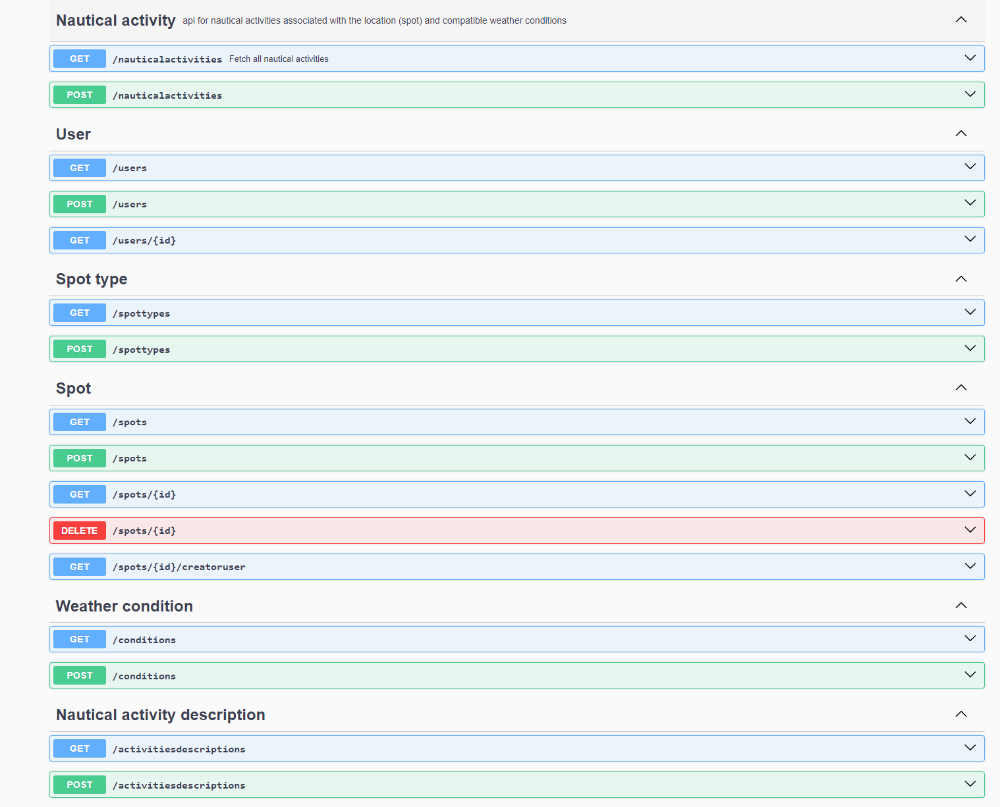

# SurfouAPI

SPRINGBOOT 3.2.4 + Hibernate Spatial + PostgreSQL16 (& PostGIS) + GeoJSON

REST API to retrieve locations of various nautical activities such as kitesurfing, windsurfing, etc., along with their associated ideal weather conditions. Users can query the API to get detailed information based on activity type, location, or weather conditions.
Using Spring Security to secure API with JWT : get the token on /auth/login endpoint with "user"/"password" credentials.

Create a database "surfoudb" with postgis extension : see createDb.sql
user: surfouAdmin & password: Pa$$w0rd

Hibernate create schema and dummy data are added on initialization : see resources/data.sql

Endpoints :
url : http://localhost:[port]/v1

Swagger3 on http://localhost:9000/v1/swagger-ui/index.html#/ :

(For spot objects : geometry a GEOJSON)

WORK IN PROGRESS 

